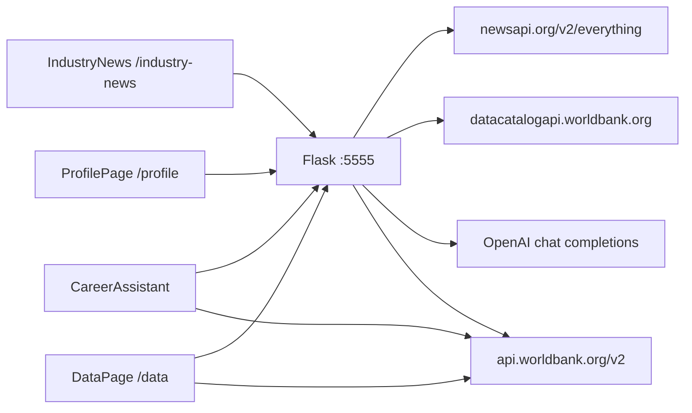

# NewsAPI and World Bank export

Portable trace of how this app fetches NewsAPI and World Bank data, which Flask routes sit in front of those calls, and which React screens render the result. Copy this directory into another application when migrating a single surface. Do not treat it as a rewrite of the app.

Application source is unchanged. This package quotes that source. Line numbers refer to the files as audited. Re-check them if the source moves.

## How to use this package

1. Open [`manifest.json`](manifest.json) and pick a seam by `id` or `userRoute`.
2. Read the linked trace. Every trace has the same six sections: user action, client call, Flask and upstream HTTP, response contract, JSX, and what a target platform must reproduce.
3. Use the JSON file under [`contracts/`](contracts/) as the request and response shape. Snippets in the traces are the call structure. Contracts are the payload structure.
4. Before porting, read [`migration/known-breaks.md`](migration/known-breaks.md). Several UI controls look like API filters and are not.

Alpha Vantage stock search and financial metrics also render on `/data`. They are out of scope except as a boundary: the “Top 5 Stocks” tiles and company-symbol search are not World Bank.

## Host map

| Caller | Base | Notes |
|--------|------|--------|
| Flask | `http://127.0.0.1:5555` and `http://localhost:5555` | Same process. Clients use both spellings. |
| Create React App proxy | `client/package.json` `"proxy": "http://localhost:5555"` | Only relative fetches (`/favorites`, `/news/...`, `/financial-metrics/...`) use it. |
| NewsAPI | `https://newsapi.org/v2/everything` | Server only. Key is env `NEWS_API_KEY`. |
| World Bank country and topic | `https://api.worldbank.org/v2/...` | Browser calls these directly. No Flask hop. |
| World Bank indicator | `http://api.worldbank.org/v2/country/all/indicator/{id}` | Flask `GET /api/world-bank` only. No UI caller. |
| World Bank Data Catalog | `https://datacatalogapi.worldbank.org/ddhxext/Search` | Flask `GET /api/search` only. |
| OpenAI chat | `https://api.openai.com/v1/chat/completions` | Career Assistant synthesis. Model `gpt-4o-mini`. Key is env `OPENAI_API_KEY`. |

Login is `localStorage` key `user_id`. `POST /login` returns `{ message, user_id, name }` and does not write `session['user_id']`. `POST /logout` clears the Flask session and the client removes `user_id`. Gates on Industry News, Data, and Career Assistant read `localStorage`, not the session cookie.

## Auth gates

| Route | Gate | Signed-out copy |
|-------|------|-----------------|
| `/industry-news` | `localStorage.user_id` in `IndustryNews` | “You must be logged in to view industry news and categories.” |
| `/profile` and `/` when logged in | `loggedInUser` prop from `App` | “Please log in to view your profile.” |
| `/data` | `localStorage.user_id` in `DataPage` | “You must be logged in to view data insights.” Country and topic fetches still run in `useEffect` before the gate hides the tiles. |
| `/career-assistant` | Nav link only if `isLoggedIn`. Page returns early without `user_id`. | “You must be logged in to use the Career Assistant.” |

Nav links live in `client/src/components/NavBar.js`. Career Assistant is the only one of these four that is hidden when signed out. Industry News and Data stay in the nav and show the gate message.

## Seam index

| id | User route | What moves |
|----|------------|------------|
| `newsapi.fetch` | none (shared) | Company name to NewsAPI `/v2/everything`, 24h memory cache |
| `news.industry.categories` | `/industry-news` | Category names for the sidebar |
| `news.industry.category` | `/industry-news` | Up to 5 `{title, url}` headlines per company in a category |
| `news.profile.favorites` | `/profile` | Favorites array, remapped `company_id` to `id` |
| `news.profile.articles` | `/profile` | One `GET /news/:id` per favorite; title links |
| `news.career.client-prefetch` | `/career-assistant` | Client favorites and news prefetch. Does not populate state. |
| `news.career.server-prompt` | `/career-assistant` | Server reloads favorites, fetches 3 headlines each, injects HTML links into the GPT prompt |
| `wb.country.browser` | `/data` | Direct country API. Tiles: name, region, income, capital |
| `wb.topic.browser` | `/data` | Direct topic API. Name and `sourceNote` |
| `wb.catalog.data-page` | `/data` | `GET /api/search` while the company search box is empty |
| `wb.topic.career` | `/career-assistant` | Topic names only, as prompt text |
| `wb.region.career` | `/career-assistant` | Region labels, not deduped, as prompt text |
| `wb.catalog.career-client` | `/career-assistant` | Report typeahead via `/api/search` |
| `wb.catalog.career-server` | `/career-assistant` | Server calls itself at `localhost:5555/api/search` and pastes the match into the prompt |
| `wb.indicator.unused` | none | `GET /api/world-bank`, default `SP.POP.TOTL`. No frontend caller |

## Traces

- [traces/01-newsapi-choke-point.md](traces/01-newsapi-choke-point.md)
- [traces/02-industry-news.md](traces/02-industry-news.md)
- [traces/03-profile-related-news.md](traces/03-profile-related-news.md)
- [traces/04-career-assistant.md](traces/04-career-assistant.md)
- [traces/05-data-page-regions-topics.md](traces/05-data-page-regions-topics.md)
- [traces/06-data-page-catalog.md](traces/06-data-page-catalog.md)
- [traces/07-career-assistant-world-bank.md](traces/07-career-assistant-world-bank.md)
- [traces/08-indicator-unused.md](traces/08-indicator-unused.md)

## Contracts

- [contracts/newsapi.request.json](contracts/newsapi.request.json)
- [contracts/newsapi.article.json](contracts/newsapi.article.json)
- [contracts/category-news.response.json](contracts/category-news.response.json)
- [contracts/company-news.response.json](contracts/company-news.response.json)
- [contracts/favorites.get.response.json](contracts/favorites.get.response.json)
- [contracts/profile.get.response.json](contracts/profile.get.response.json)
- [contracts/worldbank.country.mapped.json](contracts/worldbank.country.mapped.json)
- [contracts/worldbank.topic.mapped.json](contracts/worldbank.topic.mapped.json)
- [contracts/worldbank.indicator.json](contracts/worldbank.indicator.json)
- [contracts/datacatalog.search.json](contracts/datacatalog.search.json)
- [contracts/career-assistant.request.json](contracts/career-assistant.request.json)

## Migration notes

- [migration/seams.md](migration/seams.md) — live HTTP versus prompt-only text
- [migration/known-breaks.md](migration/known-breaks.md) — mismatches that break a naive port
- [migration/porting-checklist.md](migration/porting-checklist.md)

## Data flow

The last Flask-to-World-Bank edge is `GET /api/world-bank`. Nothing in the client calls it.
